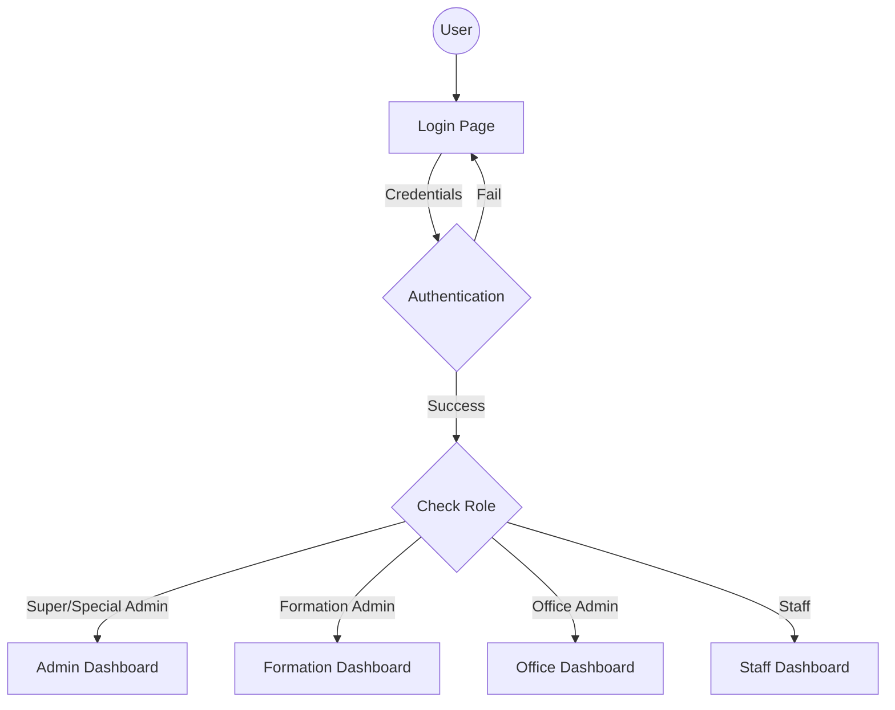

# NIS Personnel Information Management System (NIS PIMS)
## Project Presentation & Feature Overview

---

## 1. Executive Summary

**Project Name:** NIS Personnel Information Management System (NIS PIMS)

**Overview:**
The NIS PIMS is a comprehensive, web-based platform designed to streamline the management of personnel within the Nigeria Immigration Service (NIS). It replaces manual, paper-based processes with a digital solution for tracking staff postings, internal movements, promotions, and hierarchical reporting.

**Core Value Proposition:**
- **Centralized Data:** Single source of truth for all staff records.
- **Automated Workflow:** Streamlined processes for postings and transfers.
- **Role-Based Security:** Strict access controls ensuring data integrity.
- **Real-Time Insights:** Dashboards providing instant visibility into staff distribution and statistics.

---

## 2. Key Features

### A. Staff Management & Movement
- **Formation Postings:** Seamless transfer of staff between different formations (e.g., Zonal Commands, State Commands).
- **Internal Movements:** Management of staff assignments between offices within the same formation.
- **History Tracking:** Complete audit trail of a staff member's movement history (Formation History vs. Internal Office History).
- **Rank Hierarchy:** Enforced rank structure (Comptroller to Assistant Cadre) with metadata-driven sorting and visual indicators.

### B. Role-Based Access Control (RBAC)
The system features a granular permission system catering to different administrative levels:
- **Main Admin:** Full system access, global configuration.
- **Special Admin:** High-level oversight capabilities.
- **Formation Admin:** Manages staff within their specific formation (e.g., State Command).
- **Office Admin:** Manages staff within a specific office unit.
- **Staff User:** Personal access for viewing profile and requesting updates (read-only restrictions applied to critical fields).

### C. Advanced Search & Filtering
- **Modern Side-Panel Interface:** A dedicated filter sidebar for complex queries.
- **Multi-Criteria Filtering:** Filter by Rank, Office, Formation, Exit Date, and DOPA (Date of Present Appointment) ranges.
- **Smart Search:** "Search-on-Enter" functionality for rapid retrieval by Name or NIS Number.
- **Dynamic Counters:** Real-time badge counts showing active filters.

### D. Dashboards & Analytics
- **Role-Specific Views:** Dashboards adapt to the user's role (e.g., Formation Admins see stats for their formation only).
- **Statistical Summaries:** Visual breakdown of staff by rank and office.
- **Retirement Tracking:** Automated calculation of retirement dates based on DOB or Service Years.

### E. Security & Compliance
- **Audit Logging:** Comprehensive logs tracking "Who did What and When" for critical actions (Postings, Edits, Deletions).
- **Edit Authorization:** "Pending Edit" workflow requiring approval for changes to critical staff data.
- **Restricted Fields:** Staff users are technically restricted from modifying their own sensitive data (Rank, DOPP, etc.).

### F. Reporting
- **Export Capabilities:** Generate reports in Excel or PDF formats.
- **Customizable Columns:** Users can select specific data fields to include in exports.

---

## 3. Technical Architecture

### Backend
- **Framework:** Flask (Python) - Lightweight, flexible web framework.
- **ORM:** SQLAlchemy - Robust database interaction and modeling.
- **Authentication:** JWT (JSON Web Tokens) for secure, stateless session management.

### Frontend
- **UI Library:** Bootstrap 5 - Responsive, mobile-first design.
- **Scripting:** Vanilla JavaScript - Lightweight, efficient client-side logic.
- **Visualization:** Mermaid.js (for architecture flows) and Charting libraries.

### Database Schema
- **Relational Model:** Normalized tables for `Staff`, `Formations`, `Offices`, `Users`, and `AuditLogs`.
- **Hierarchy:** Recursive relationships for Formation and Office structures.

---

## 4. Recent Enhancements (v2.0)

1.  **UX Overhaul:** Conversion of top-bar filters to a modern, collapsible side-panel interface.
2.  **Notification System:** Integrated in-app notifications for admins regarding incoming postings and movements.
3.  **Data Integrity:**
    -   Hyperlinked NIS Numbers for quick profile access.
    -   Mandatory password changes for default logins.
    -   Validation fixes for "Request Failed" scenarios during movement.
4.  **Visual Aids:** System architecture flowcharts integrated into the documentation.

---

## 5. System Flowchart

*(See `flowchart.html` for interactive view)*

---

## 6. Future Roadmap
- **Biometric Integration:** Linking staff profiles with biometric data.
- **Mobile App:** dedicated mobile application for field officers.
- **AI Analytics:** Predictive modeling for staff attrition and deployment optimization.
